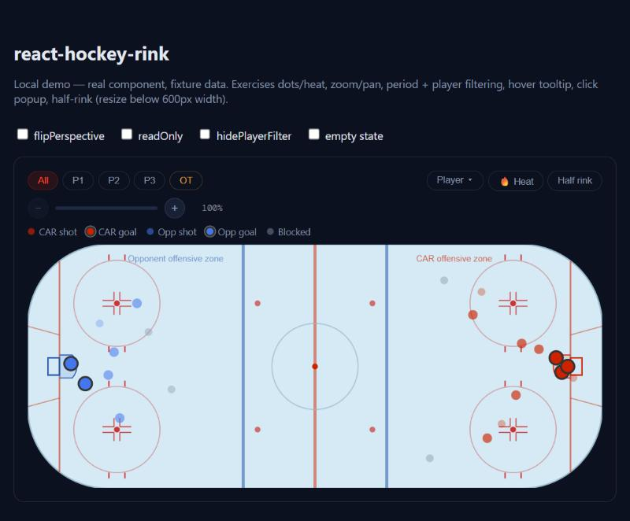

# react-hockey-rink

[](https://www.npmjs.com/package/react-hockey-rink)
[](./LICENSE)

An interactive, themeable ice rink shot chart for React. Dots or a kernel-density
heat map, zoom/pan, period and player filtering, hover tooltips, and click-through
shot detail — all rendered on a pixel-accurate NHL rink (200ft × 85ft, real goal
creases, faceoff circles, trapezoid, and restraint marks).

No CSS framework required — ships its own default-themed stylesheet you can
override with CSS custom properties.



## Install

```bash
npm install react-hockey-rink
```

## Usage

```jsx
import { HockeyRink } from 'react-hockey-rink';
import 'react-hockey-rink/styles.css';

const events = [
  {
    id: 'evt-1',
    team: 'primary',           // 'primary' | 'opponent'
    type: 'goal',               // 'goal' | 'shot-on-goal' | 'missed-shot' | 'blocked-shot'
    x: 84, y: 3,                 // NHL ice coords: x ±100 (goal line to goal line), y ±42.5 (boards to boards)
    period: 1,
    timeInPeriod: '9:14',
    shooterId: 1,
    shooterName: 'A. Player',
    assist1Name: 'B. Setup',
    goalieName: 'C. Netminder',
    shotType: 'Wrist',
    shotSpeed: 94,
    zoneCode: 'O',
  },
  // ...
];

function ShotMap() {
  return (
    <HockeyRink
      events={events}
      teamAbbr="CAR"
      teamColor="#cc2200"
    />
  );
}
```

The primary team always attacks toward the right side of the rink (pass
`flipPerspective` to flip that — useful for a penalty-kill or defensive-zone
view of the same data).

## Props

| Prop               | Type                              | Default | Description |
|---------------------|-----------------------------------|---------|--------------|
| `events`            | `Event[]`                         | `[]`    | Shot events to render — see schema below. |
| `teamAbbr`           | `string`                          | `'TEAM'`| Abbreviation shown in the legend, zone labels, and popups for the primary team. |
| `teamColor`          | `string` (any CSS color)          | —       | Fill color for the primary team's dots. Falls back to `var(--rink-team-primary)`. |
| `flipPerspective`    | `boolean`                         | `false` | Flips which side the primary team attacks — for a defensive/PK-style view. |
| `hidePlayerFilter`   | `boolean`                         | `false` | Hides the player-filter dropdown even if shooters are present. |
| `readOnly`           | `boolean`                         | `false` | Hides the toolbar, zoom controls, legend, tooltip, and popup — renders a static rink. |

### Event schema

```ts
type Event = {
  id: string | number;
  team: 'primary' | 'opponent';
  type: 'goal' | 'shot-on-goal' | 'missed-shot' | 'blocked-shot';
  x: number;              // -100..100, ice coordinates
  y: number;               // -42.5..42.5
  period: number;           // 1-3 regulation, 4+ = OT1, OT2, ...
  timeInPeriod: string;      // e.g. '9:14'
  shooterId?: string | number;
  shooterName?: string;
  assist1Name?: string;
  assist2Name?: string;
  goalieName?: string;
  blockerName?: string;
  shotType?: string;
  shotSpeed?: number;
  zoneCode?: 'O' | 'D' | 'N';
};
```

## Theming

Every color, radius, and font in the default stylesheet is a CSS custom
property, prefixed `--rink-*` so it won't collide with anything else on the
page. Override any subset on `:root` (or a scoped ancestor) — no build step
required:

```css
:root {
  --rink-bg1: #ffffff;
  --rink-text: #111111;
  --rink-team-primary: #003087;
  --rink-radius-lg: 8px;
}
```

Full token list:

| Token | Default | Used for |
|-------|---------|----------|
| `--rink-bg1` | `#0c1120` | Popup / tooltip / dropdown background |
| `--rink-bg3` | `#172035` | Zoom button / dropdown hover background |
| `--rink-bg4` | `#1e2a42` | Zoom track background, zoom button hover |
| `--rink-red` | `#cc2200` | Zoom progress fill |
| `--rink-red-bright` | `#ff4422` | Active filter buttons, primary-team tooltip |
| `--rink-red-dim` | `rgba(204,34,0,0.15)` | Active filter button background |
| `--rink-red-border` | `rgba(204,34,0,0.35)` | Active filter button border |
| `--rink-blue-bright` | `#4d80f0` | Opponent-team tooltip/badge text |
| `--rink-blue-dim` | `rgba(34,68,170,0.15)` | Opponent badge background |
| `--rink-amber` | `#f0a030` | OT period buttons, shot-speed values |
| `--rink-text` | `#e4e8f0` | Primary text |
| `--rink-text-muted` | `#8a99aa` | Secondary text, legend |
| `--rink-text-dim` | `#808a94` | Tertiary text, labels |
| `--rink-border` | `rgba(255,255,255,0.06)` | Hairline dividers |
| `--rink-border-2` | `rgba(255,255,255,0.12)` | Button/panel borders |
| `--rink-radius-sm` | `6px` | SVG container corner radius |
| `--rink-radius-lg` | `14px` | Popup corner radius |
| `--rink-font-display` | `'Barlow Condensed', sans-serif` | Popup headings |
| `--rink-font-mono` | `'DM Mono', monospace` | Speed/zoom readouts |
| `--rink-team-primary` | `#ff4422` | Primary-team dot fill fallback |

## Examples

**Heat map instead of dots by default** — not exposed as a prop; the toggle
lives in the toolbar. Render with `readOnly` and drive `viewMode` yourself if
you need a heat-only embed (open an issue/PR if you need this as a prop).

**Half rink on mobile** happens automatically below a 600px container width;
users can also toggle it manually via the toolbar on wider screens.

**Read-only embed** (e.g. a small preview card, no interaction):

```jsx
<HockeyRink events={events} teamAbbr="CAR" readOnly />
```

## Development

```bash
npm install
npm run demo    # local demo app with fixture data, http://localhost:5183
npm test        # Vitest smoke tests
npm run build   # library build (ESM + CJS) to dist/
npm run lint
```

## License

MIT
